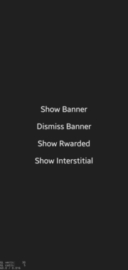
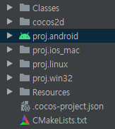

# Yodo1 MAS Example Project(cocos2d-x)

## Example Test Envrionment
CPU : intel i3-2100    
RAM : 4GB  
GPU : GTS 450  
COCOS2D-X : 4.0    
MAS : 4.0.4.1  
ANDROID STUDIO : 4.1.3  
MOBILE : SAMSUNG GALAXY S10+

 

## CAUTION

## Example Showcase

 

## CAUTION
This example was created as an example of using MAS.  
In order to actually launch the game, the package name must be applied the same as the MAS dashboard. 

## How to run Example 

### Android Studio Setting for Cocos2D-X
1. Make a new cocos2d-x project for example.
   > cocos new example -l cpp
2. Overwrite the files in src/Cocos2D in the project folder. 
The files in src/Cocos2D are as follows.  
<CMakeList.txt>  
This is a CMake file that helps build c++ code in Android Studio.  
<AppDelegate & ExampleScene>  
This is a simplified ExampleScene.   
<Yodo1Mas/Android.hpp> 
This is a header file that defines functions that can use MAS. 

3. Open proj.android with Android Studio.   
    

4. Modify the Gradle version and Gradle plugin properties.  
You can find it in [File]-[Project Structure].   
      

6. Modify PROP_MIN_SDK_VERSION and PROP_APP_ABI in Gradle.properties. 
    > PROP_MIN_SDK_VERSION=19  
    > PROP_APP_ABI=armeabi-v7a:arm64-v8a

7. Modify ScreenOrientation in AndroidManifest.xml.   
     
   the example works fine even with lanscape. 

 

### MAS INTEGRATION
1. Follow the MAS document [Android SDK Integration](https://support.yodo1.com/hc/en-us/articles/1500002038322).   
It's really easy enough to just copy and paste step by step in order. 

2. Overwrite AppActivity.java in src/Android Studio.  
Don't forget to change the APP-KEY to your own like you did with Android SDK Integration! 

### USB BUILD & PLAY
Now, everything is ready.  
Connect the Android mobile device to be tested via USB, build and run it. 

 

## EXAMPLE ANALYSIS
### AppActivity
In AppActivity class, MAS functions are defined as static public.  
This is for illustrative purposes only and is not a fixed rule. :)

### Android.hpp
Use JniHelper of cocos2d-x to call static functions defined in AppActivity.  

### 키워드
yodo1, Yodo1Mas, MAS, cocos2d-x, JNI, jniHelper