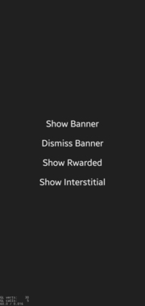
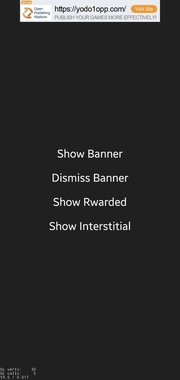
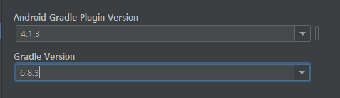
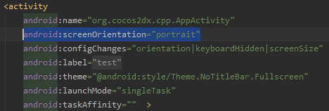

# Yodo1 MAS 예제 프로젝트(cocos2d-x)

## 예제 테스트 환경
CPU : intel i3-2100    
RAM : 4GB  
GPU : GTS 450  
COCOS2D-X : 4.0    
MAS : 4.0.4.1  
ANDROID STUDIO : 4.1.3  
MOBILE : SAMSUNG GALAXY S10+

 

## 예제 실행화면

 

## 주의사항
이 예제는 어디까지나 MAS를 사용하는 예시로서 만들어졌습니다.  
실제로 게임을 런칭하기 위해서는 패키지 이름도 MAS 대시보드와 동일하게 적용해야 합니다.

## 예제 실행방법

### Cocos2D-X 안드로이드 빌드 설정.
1. 새로운 cocos 프로젝트 생성
   > cocos new example -l cpp
2. src/Cocos2D 에 있는 파일들을 프로젝트 폴더에 덮어씌어줍니다.  
src에 있는 파일들은 각각 아래와 같습니다.  
<CMakeList.txt>  
안드로이드 스튜디오에서 코드를 빌드할 수 있도록 도와주는 CMake 파일입니다.    
<AppDelegate & ExampleScene>  
간단하게 구현된 ExampleScene 입니다.  
<Yodo1Mas/Android.hpp> 
MAS를 사용할 수 있는 함수들이 정의 된 헤더파일입니다.

3. 안드로이드 스튜디오로 proj.android를 열어줍니다.  
    

4. Gradle 버전과 Gradle 플러그인 속성을 수정합니다.
[File] - [Project Structure] 에서 찾을 수 있습니다.  
    

6. Gradle.properties에서 PROP_MIN_SDK_VERSION과 PROP_APP_ABI를 수정합니다.
    > PROP_MIN_SDK_VERSION=19  
    > PROP_APP_ABI=armeabi-v7a:arm64-v8a

7. AndroidManifest.xml에서 ScreenOrientation을 수정합니다.  
     
   lanscape여도 예제는 정상적으로 동작합니다.

 

### MAS 연동
1. MAS 문서 [Android SDK Integration](https://support.yodo1.com/hc/en-us/articles/1500002038322)을 따라합니다.  
순서대로 차근차근 복사 붙여넣기만 하면 될 정도로 정말 쉽습니다.

2. src/Android Studio 에 있는 AppActivity.java를 덮어 씌어줍니다.  
Android SDK Integration에서 했던 것처럼 APP-KEY를 본인 것으로 바꿔주는 것을 잊지 마세요!

### USB 빌드 및 실행
자, 이제 모든 준비가 완료 되었습니다.  
USB로 테스트할 안드로이드 모바일 기기를 연결하고 빌드하고 실행하면 됩니다.

 

## 예제 분석
### AppActivity
AppActivity 클래스 안에 MAS 함수들을 static public으로 정의했습니다.  
이것은 어디까지나 예제를 위한 것이고 고정된 규칙은 아닙니다. :)

### Android.hpp
cocos2d-x의 JniHelper를 사용해서 AppActivity에 정의 된 static 함수들을 호출합니다.  

### 키워드
yodo1, Yodo1Mas, MAS, cocos2d-x, JNI, jniHelper